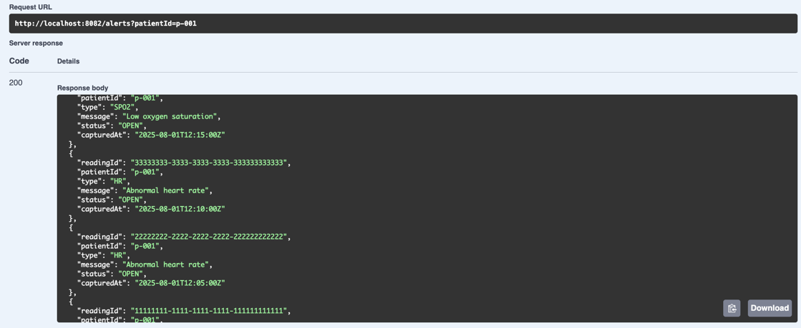
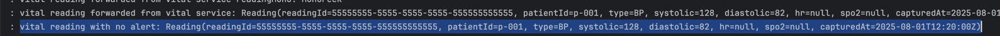
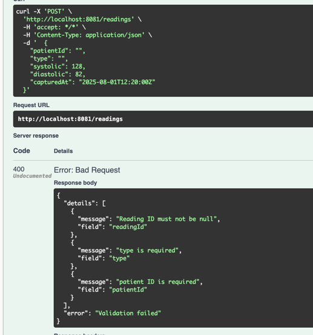
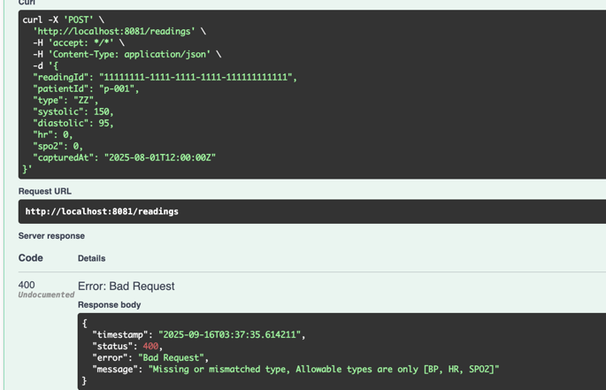
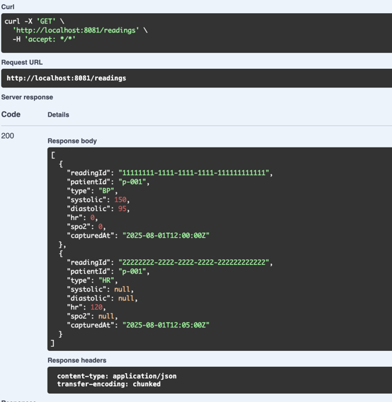

##  Notes
- vitals-service validates readings by type:
  BP requires systolic and diastolic
  HR requires hr
  SPO2 requires spo2
-  Duplicate readings are ignored (based on readingId)
-  Valid readings are forwarded to Alerts Service (http://localhost:8082/evaluate)
-  No authentication or error mapping is implemented yet — kept simple for demo.

###  Swagger UI (I added swagger api for convenience)
- http://localhost:8081/swagger-ui/index.html (vital-service)
- http://localhost:8082/swagger-ui/index.html (alert-service)

###  Alerts Generated using sample data from src/main/resources/mockdata.json

###  No alert for following Data:
{
"readingId": "55555555-5555-5555-5555-555555555555",
"patientId": "p-001",
"type": "BP",
"systolic": 128,
"diastolic": 82,"capturedAt": "2025-08-01T12:20:00Z"
}

 you can find log entry related to this  in alter-service log

### Implemented Validations 
- Used @RestControllerAdvice(@see GlobalErrorController.java in vital-service project)
- Provided support for Jakarta Bean Validation (e.g., @Valid, @NotNull) using Hibernate Validator 
  through dependency spring-boot-starter-validation
- Following two images shows
- 1. Validation for required fields like patientId, readingId an types
- 2. Validation for mismatched field for type (only allowed BP,HR &bSPO2)

## Supported In Memory Database H2 (for vital-service) along with ConcurrentHashMap 
patients vitals are persisted concurrent Hash as well as persisted in table called readings(@see schema.sql)
in H2 database (for now in memory only but with little config change it can be persisted on file)
-- following vitals come from the reading table

curl -X 'GET' \
'http://localhost:8081/readings' \
-H 'accept: */*'

### Post results via curl or using swagger api 
- for more data @see src/main/resources/mockdata.json

curl -X 'POST' \
'http://localhost:8081/readings' \
-H 'accept: /' \
-H 'Content-Type: application/json' \
-d '{
"readingId": "11111111-1111-1111-1111-111111111112",
"patientId": "p-001",
"type": "BP",
"systolic": 150,
"diastolic": 95,
"capturedAt": "2025-08-01T12:00:00Z"
}'

### Retrieve alerts via curl or using swagger api
curl "http://localhost:8082/alerts?patientId=p-001"

